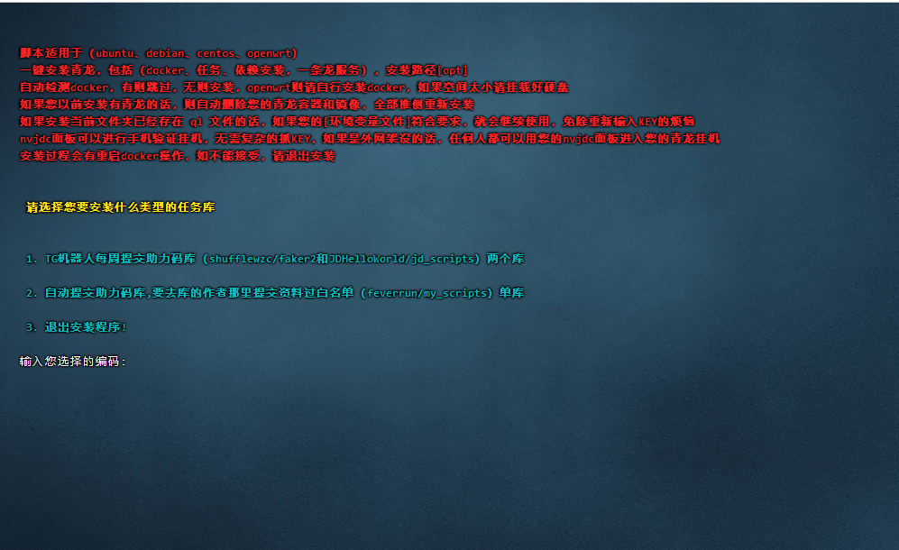
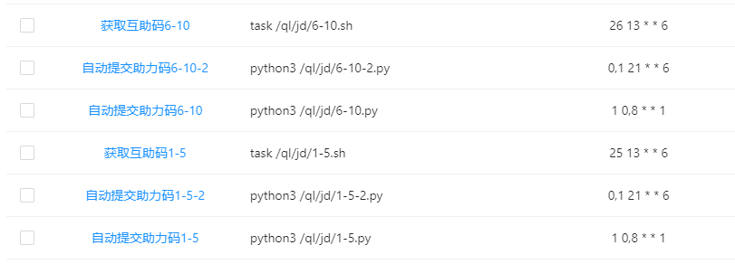

#### 🚩 一键安装青龙面板命令




#### 🚩 全自动提交助力码到互助池

#
- 为防止系统没安装curl，使用不了一键命令，使用一键安装青龙面板命令之前先执行一次安装curl命令

- 安装curl请注意区分系统，openwrt千万别另外安装curl，openwrt本身自带了，另外安装还会用不了
#

- 使用root用户登录ubuntu或者debian系统，后执行以下命令安装curl
```sh
apt -y update && apt -y install curl
```

- 使用root用户登录centos系统，后执行以下命令安装curl
```sh
yum install -y curl
```
#
- 国外鸡地址，执行下面一键命令安装青龙+依赖+任务+NVJDC自由选择（安装完毕后再次使用命令可以对应用进行升级）
```sh
bash -c "$(curl -fsSL https://raw.githubusercontent.com/shidahuilang/QL-/main/lang1.sh)"
```
- 国内鸡地址，执行下面一键命令安装青龙+依赖+任务+NVJDC自由选择（安装完毕后再次使用命令可以对应用进行升级）
```sh
bash -c "$(curl -fsSL https://ghproxy.com/https://raw.githubusercontent.com/shidahuilang/QL-/main/lang1.sh)"
```
#
- 单独安装rabbit一键脚本
```sh
bash -c "$(curl -fsSL https://ghproxy.com/https://raw.githubusercontent.com/shidahuilang/QL-/main/rabbit.sh)"
```
- 单独安装NVJDC一键脚本（懒得升级修改，凑合用）
```sh
bash -c "$(curl -fsSL https://ghproxy.com/https://raw.githubusercontent.com/shidahuilang/QL-/main/nvjdc.sh)"
```
- 单独安装阿东一键脚本（免费有限制，一天扫码2次，低调使用，如有批量需求，请捐赠原作者）
```sh
bash -c "$(curl -fsSL https://ghproxy.com/https://raw.githubusercontent.com/shidahuilang/QL-/main/adong/adong.sh)"
```

## 第二步

#### 🚩 如果上面的命令运行成功会有提示，按提示操作登录面板


- 登录面板后，在‘ 环境变量 ’项添加 WSKEY 或者 PT_KEY

- 添加 wskey 或者 pt_key 都要注意KEY里面的分号，英文分号，记得别省略了，WSKEY和PT_KEY二选一即可

- 格式如下：

```sh
# > 添加 wskey

名称
JD_WSCK

值
pin=您的账号;wskey=您的wskey值;


# > 添加PT_KEY

名称
JD_COOKIE

值
pt_key=您的pt_key值;pt_pin=您的账号;
```

#
#### 🚩 青龙面板安装依赖方法
- ####  依赖管理 --> 添加依赖 --> 依赖类型(NodeJs) --> 自动拆分(是) --> 名称(把下面依赖名称全复制粘贴) --> 确定 
```sh
date-fns
axios
ts-node
typescript
png-js
crypto-js
md5
dotenv
got
ts-md5
tslib
@types/node
requests
tough-cookie
jsdom
download
tunnel
fs
ws
js-base64
jieba
canvas
```
#
#### 🚩 单独安装某项的一键脚本


- 一键单独安装docker
```sh
bash -c "$(curl -fsSL https://ghproxy.com/https://raw.githubusercontent.com/shidahuilang/QL-/main/docker.sh)"
```

- 一键安装单独青龙的依赖
```sh
docker exec -it qinglong bash -c  "$(curl -fsSL https://ghproxy.com/https://raw.githubusercontent.com/shidahuilang/QL-/main/npm.sh)"
```
#### 🚩 单独F2拉库
YYDS库
```sh
ql repo https://github.com/okyyds/yyds.git "jd_|jx_|gua_|jddj_|jdCookie" "activity|backUp" "^jd[^_]|USER|function|utils|sendNotify|ZooFaker_Necklace.js|JDJRValidator_|sign_graphics_validate|ql|JDSignValidator" "master"
```
大灰狼备份库
```sh
ql repo https://github.com/shidahuilang/f2.git "jd_|jx_|gua_|jddj_|jdCookie" "activity|backUp" "^jd[^_]|USER|function|utils|sendNotify|ZooFaker_Necklace.js|JDJRValidator_|sign_graphics_validate|ql|JDSignValidator"
```

## 感谢！


> [`whyour`]
> [`NolanHzy`]
> [`danshui`]
> [`feverrun`]
> [`Aaron-lv`]
> [`faker2`] 

